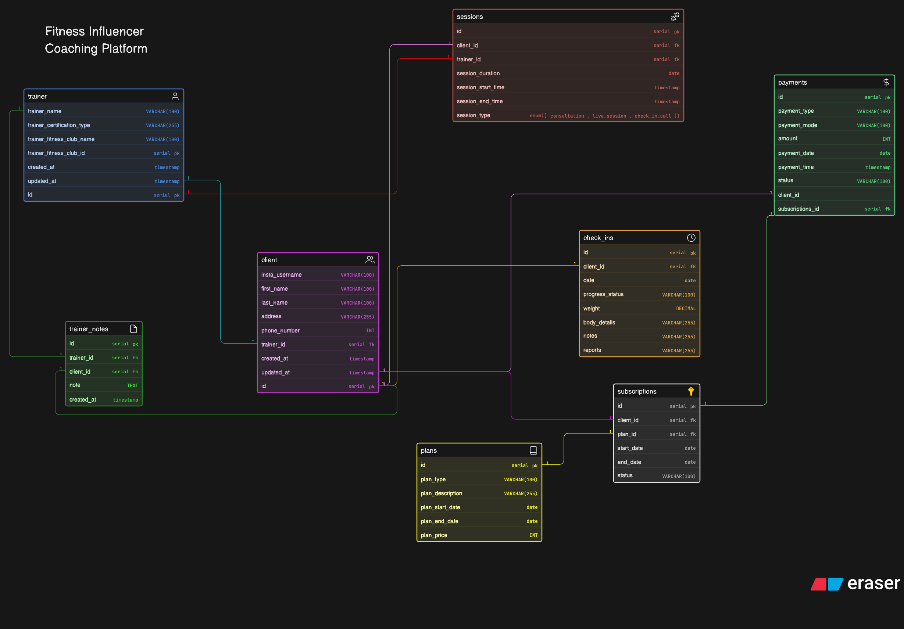

# Fitness Influencer Coaching Platform

## Project Overview

This project presents the Entity-Relationship (ER) Diagram for a scalable Fitness Influencer Coaching Platform.

As fitness influencers grow beyond informal platforms like Instagram DMs and video calls, they require a structured system to:

Manage clients
Offer coaching plans
Handle subscriptions
Schedule sessions
Track progress
Maintain trainer feedback
Process payments

This design models a real-world online coaching ecosystem, not a traditional gym management system.

## Objective

To design a normalized and scalable database schema that answers key business questions:

- Who are the trainers and clients?
- What coaching plans are available?
- Which client subscribed to which plan?
- What is the duration of a subscription?
- Are sessions being scheduled?
- Are clients submitting regular check-ins?
- How is progress tracked over time?
- How are payments managed?

## System Design Approach

The schema is designed with the following principles:

- Normalization (avoid redundancy)
- Separation of concerns (different tables for different responsibilities)
- Scalability (supports growth in users and data)
- Real-world mapping (aligned with actual coaching workflows)

## Relationships & Cardinality

| Relationship            | Type        |
| ----------------------- | ----------- |
| Trainer → Clients       | One-to-Many |
| Client → Subscriptions  | One-to-Many |
| Plan → Subscriptions    | One-to-Many |
| Client → Sessions       | One-to-Many |
| Trainer → Sessions      | One-to-Many |
| Client → Check-ins      | One-to-Many |
| Trainer → Notes         | One-to-Many |
| Client → Notes          | One-to-Many |
| Subscription → Payments | One-to-Many |

## Submission Details

This repository includes:

- ER Diagram (Image / Board link)
  

- Clearly labeled:
  - Entities
  - Attributes
  - Primary Keys (PK)
  - Foreign Keys (FK)
  - Relationships
