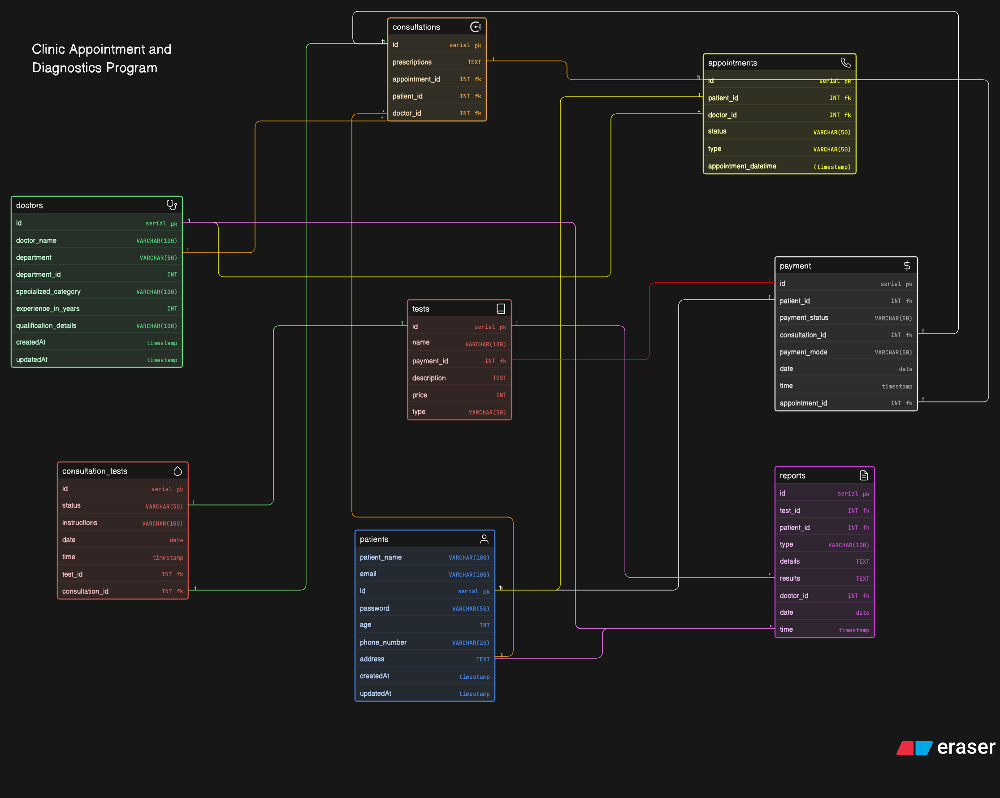

# Clinic Appointment and Diagnostics Platform

## Overview

This project represents the Entity-Relationship Diagram (ERD) for a modern clinic system.
The system is designed to digitally manage:

Patients
Doctors
Appointments
Consultations (Visits)
Diagnostic Tests
Reports
Payments

The goal is to model a clean, scalable database structure that reflects real-world clinic workflows.

## Objective

The ERD answers key business questions such as:

Who are the doctors and their specialties?
Which patient booked which appointment?
What is the status of each appointment?
Did an appointment result in a consultation?
What diagnostic tests were prescribed?
What reports were generated?
Can a patient have multiple visits? Yes
Can a doctor attend multiple patients? Yes
Can a consultation lead to multiple tests? Yes
How are payments tracked? Linked to appointments/consultations

## Relationships

- Patient → Appointment → One-to-Many
- Doctor → Appointment → One-to-Many
- Appointment → Consultation → One-to-One
- Patient → Consultation → One-to-Many
- Doctor → Consultation → One-to-Many
- Consultation → Tests → One-to-Many
- Test → Report → One-to-One
- Patient → Payment → One-to-Many

## Workflow

1. Patient books an appointment
2. Appointment may result in a consultation
3. Doctor may prescribe tests
4. Tests generate reports
5. Payments are recorded for services

## Notes

- Primary Keys (PK) and Foreign Keys (FK) are clearly defined in the diagram.
- The design follows normalization principles to avoid redundancy.
- The system is scalable and can be extended for larger healthcare systems.

## ER Diagram

