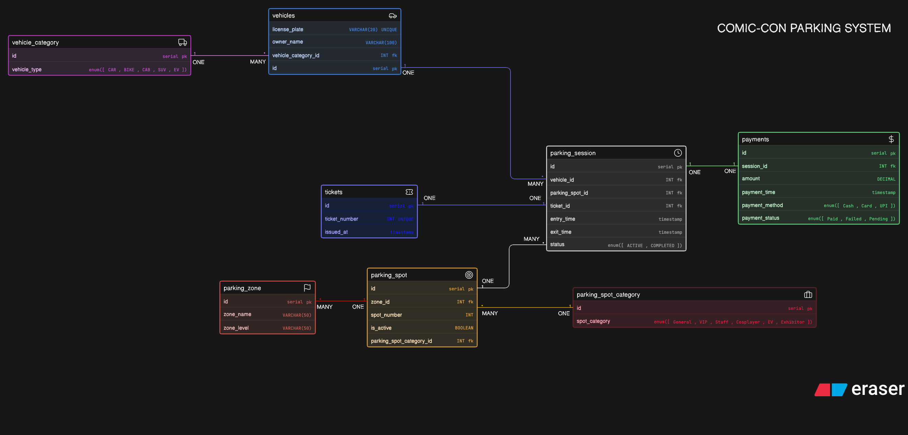

# COMIC-CON PARKING SYSTEM

## Overview:

This project represents the database design (ER Diagram) for a large-scale Comic-Con event parking system. The system is designed to efficiently manage vehicle entries, parking allocations, reserved categories, sessions, and payments across multiple zones and levels.

The goal of this design is to reflect a real-world, scalable parking system capable of handling thousands of vehicles during a multi-day event.

## Problem Statement:

During Comic-Con, visitors arrive using different types of vehicles such as bikes, cars, SUVs, EVs, and cabs. The venue provides structured parking with:

Multiple zones and levels
Reserved parking categories (VIP, Staff, Exhibitors, Cosplayers, EV charging)
Dynamic spot allocation
Entry and exit tracking
Payment handling

This system ensures smooth parking operations while maintaining accurate records of all parking activities.

## Relationships:

- One Vehicle → Many ParkingSessions
- One ParkingSpot → Many ParkingSessions
- One ParkingZone → Many ParkingSpots
- One SpotCategory → Many ParkingSpots
- One VehicleCategory → Many Vehicles
- One ParkingSession → One Payment
- One ParkingSession → One ParkingTicket

## ER Diagram:

