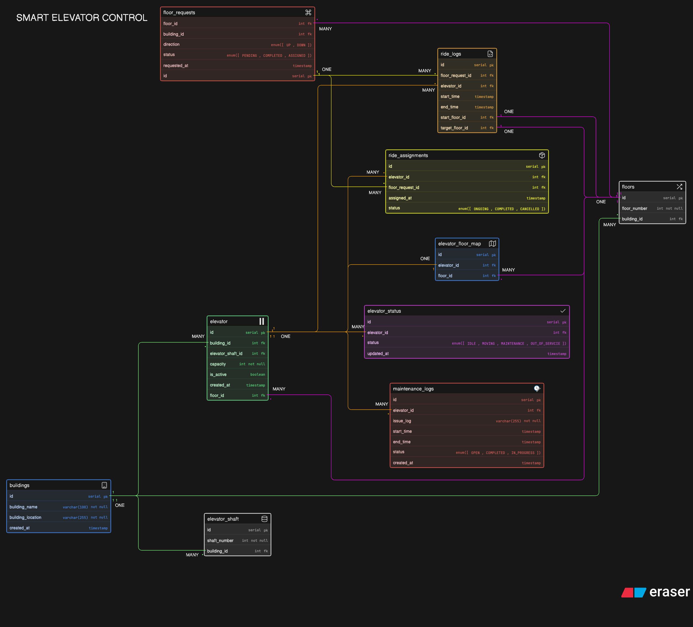

# Smart Elevator Control

## Overview:

This project represents the Entity Relationship Diagram (ERD) and database design for a Smart Elevator Control System.
It models how elevators, floors, user requests, and maintenance operations interact within a building.

The goal is to create a scalable backend structure that can efficiently handle:

- Floor requests
- Elevator movement tracking
- Maintenance logs
- System state monitoring

## Problem Statement:

The system simulates real-world elevator operations by organizing data into structured relational tables.

Core ideas:

- Multiple elevators serve multiple floors
- Users generate floor requests
- Elevators process requests based on logic (not part of DB)
- Maintenance logs track issues and repairs

## Relationship Summary:

1. Building relationships (Color = Green-lines):

- Building (One) -> Floors (Many)
- Building (One) -> Elevator (Many)
- Building (One) -> Elevator Shaft (Many)

2. Floor-Request relationsships (Color = Yellow-lines):

- Floor-request (One) => Ride Logs (Many)
- Floor-request (One) => Ride Assignments (Many)

3. Elevator realtionships (Color = Orange-lines):

- Elevator (One) => Ride Assignments (Many)
- Elevator (One) => Ride Logs (Many)
- Elevator (One) => Maintenance-logs (Many)
- Elevator (One) => Elevator Status (Many)
- Elevator (One) => Elevator-floor-map (One)

4. Floors relationships (Color = Magenta-lines):

- Floor (One) => Elevators (Many)
- Floor (One) => Elevator-floor-map (Many)
- Floor (One) => Floor-requests (Many)
- Floor (One) => Ride Logs Start Floor (One)
- Floor (One) => Ride Logs Target Floor (One)

## ER-Diagram:

