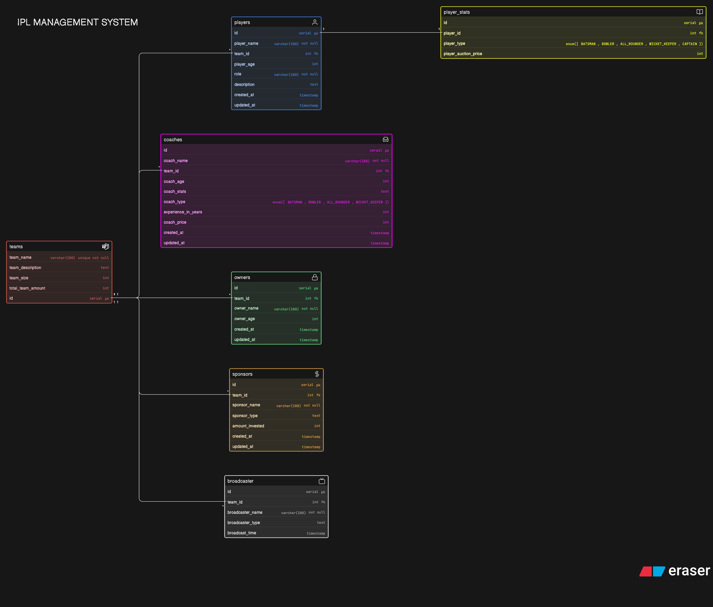

# IPL Management System

A relational database design for managing an IPL-style cricket league. This system handles teams, players, coaches, owners, sponsors, broadcasters, and player statistics.

## Overview

This project represents an Entity-Relationship (ER) Diagram for an IPL Management System. It is designed to:

- Manage team structures
- Track players and their roles
- Maintain coaching staff data
- Handle ownership and sponsorship
- Store broadcasting information
- Track player auction and performance stats

## Relationships

- Teams → Players (1:N)
- Players → Player Stats (1:1 or 1:N)
- Teams → Coaches (1:N)
- Teams → Owners (1:1 or 1:N)
- Teams → Sponsors (1:N)
- Teams → Broadcasters (1:N)

## ER-Diagram

