# Desktop-First developer tool landing page

## Description

This assignment represents the desktop-first developer tool landing page inspired by Cursor landing page. This webpage is created using HTML & CSS only. Also it does not contain any responsiveness as it is desktop-first webpage

## Sections Created in Cursor Webpage

1. Top Navigation Bar

- Logo, nav links, primary CTA

- Dark background

2. Hero Section

- Main headline, description, CTA

- Large product screenshot

3. Trusted By / Logos

- Row of company logos

4. Feature Sections (3 blocks)

- Two-column layout (text + image)

- Alternate image/text positions

5. Feature Cards Section

- Section title

- Grid of 3–4 cards

6. Testimonials

- Quote cards with name and role

7. Use Cases / Stories

- Cards with image + short text

8. Changelog / Updates

- List of updates with date

9. Team / About

- Large image + short description + CTA

10. Final CTA

- Big heading + single button

11. Footer

- Multi-column links and company info

## Screenshots

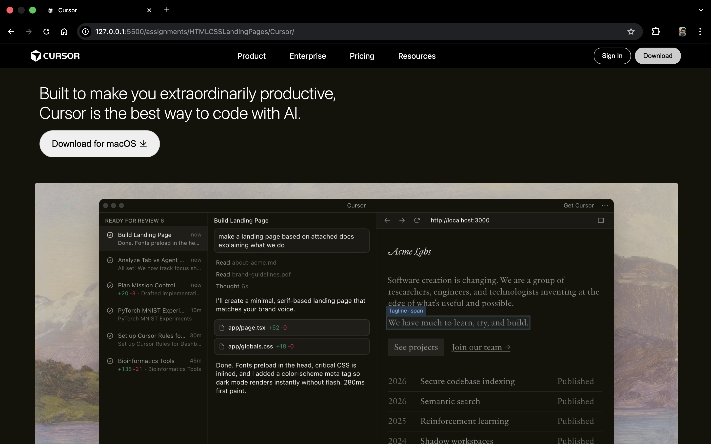

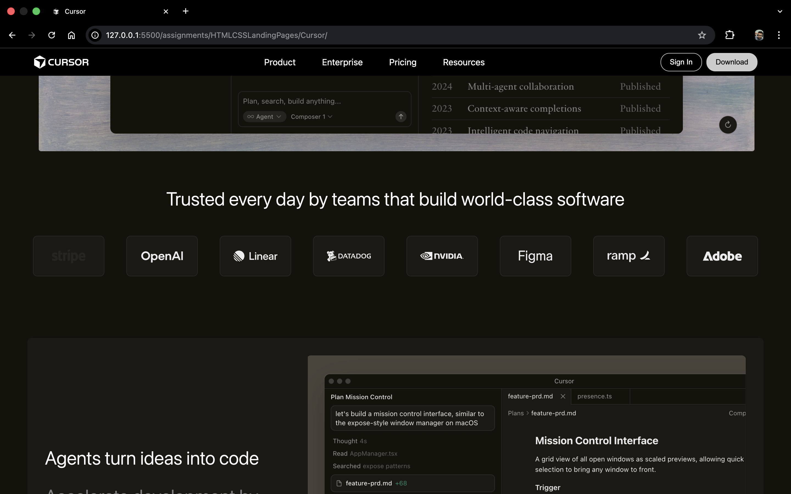

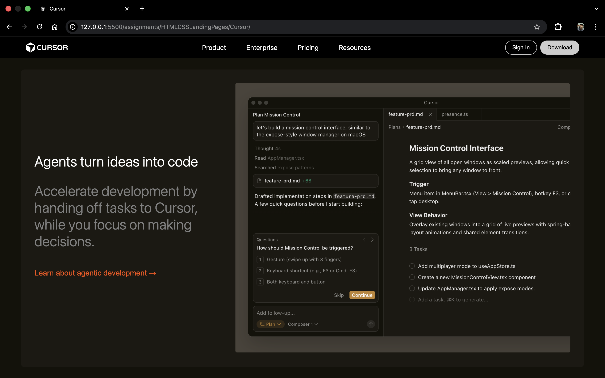

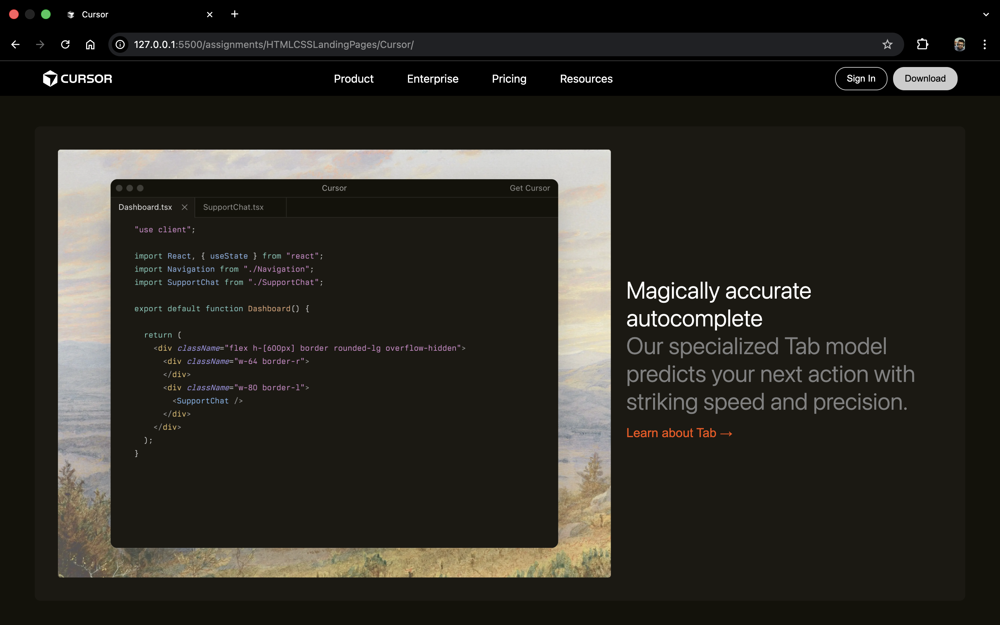

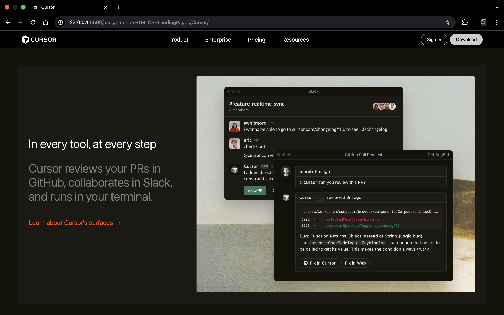

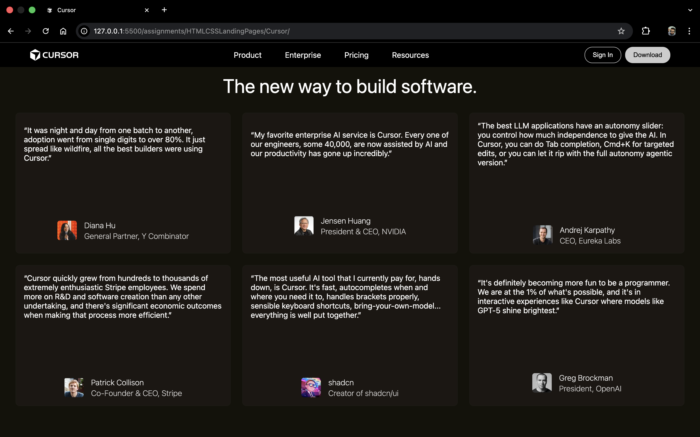

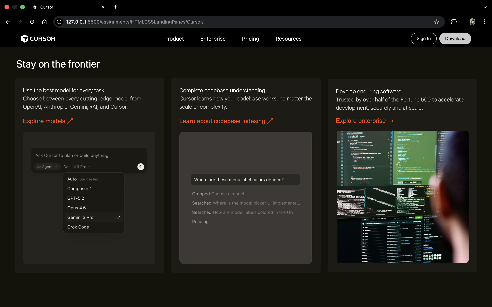

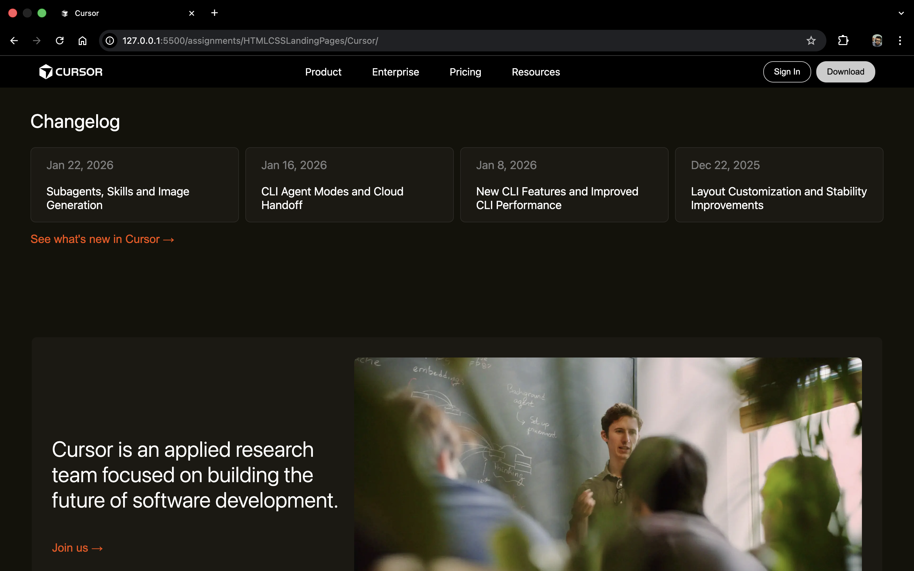

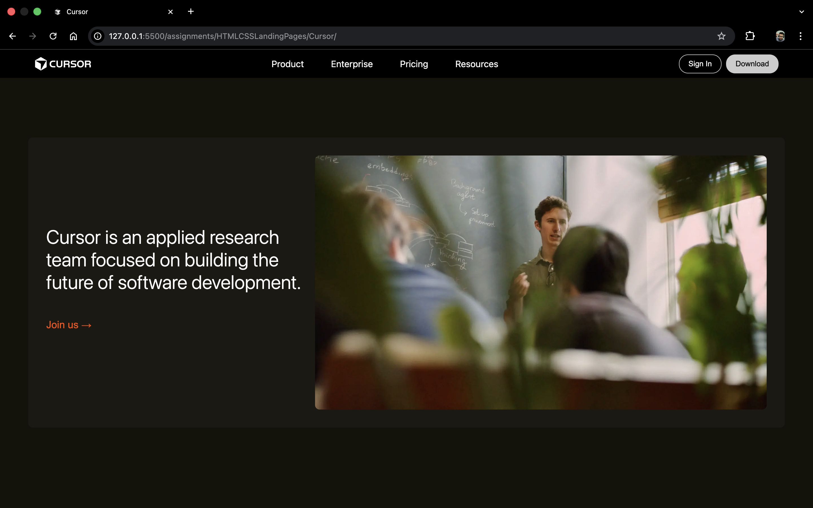

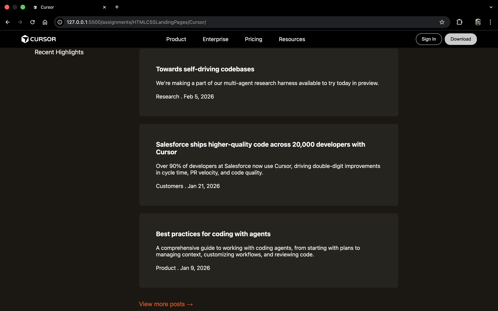

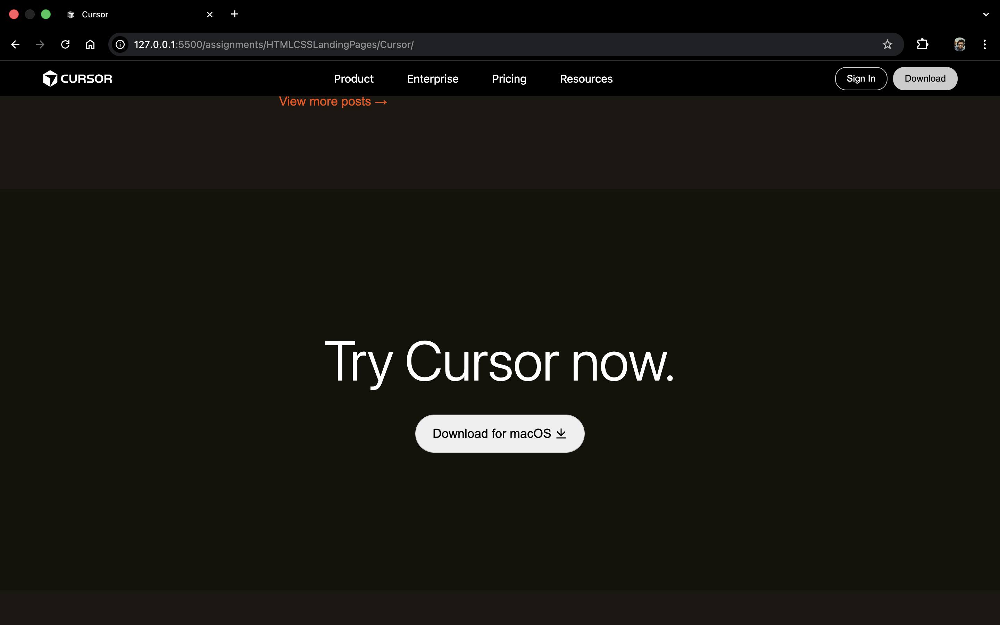

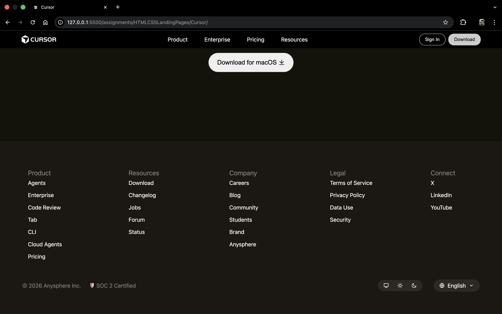
