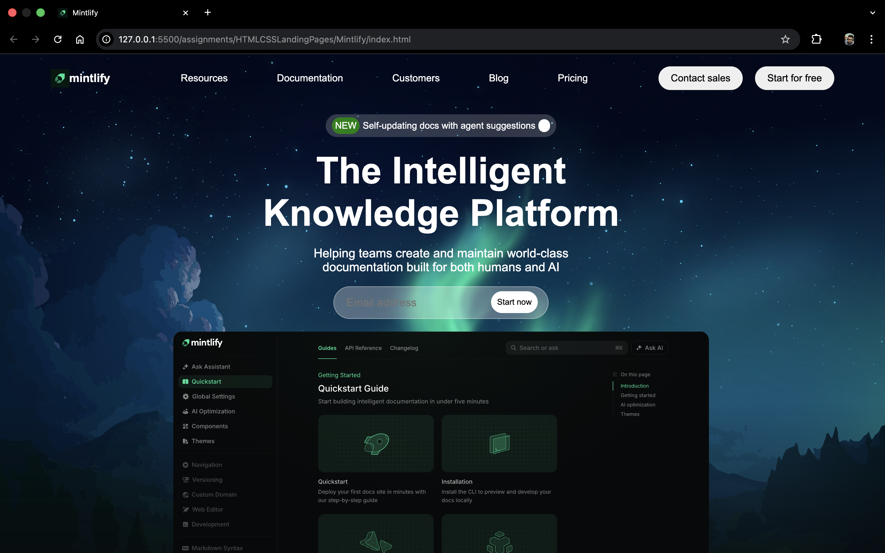
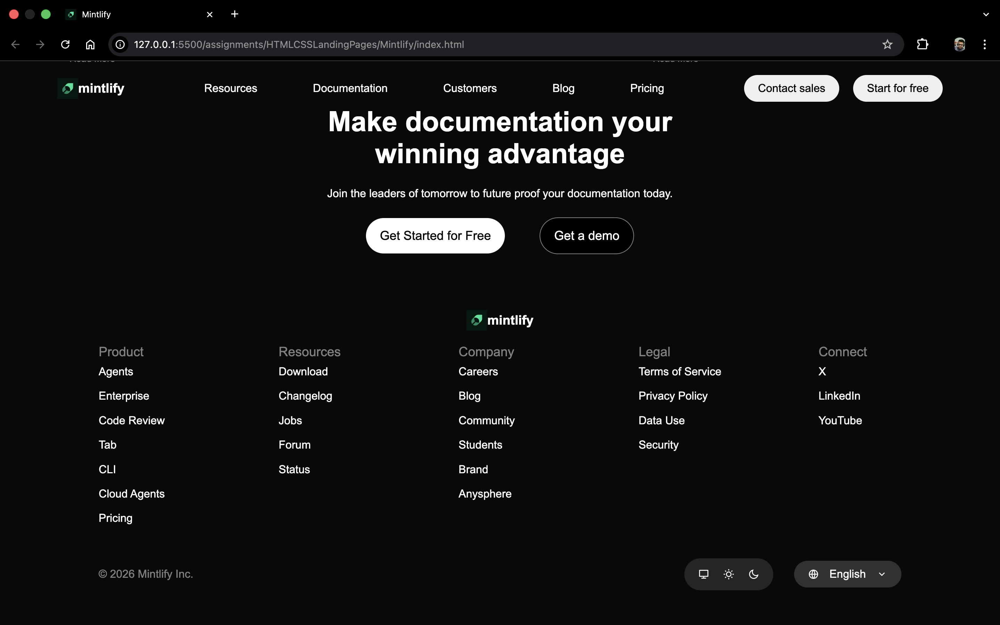
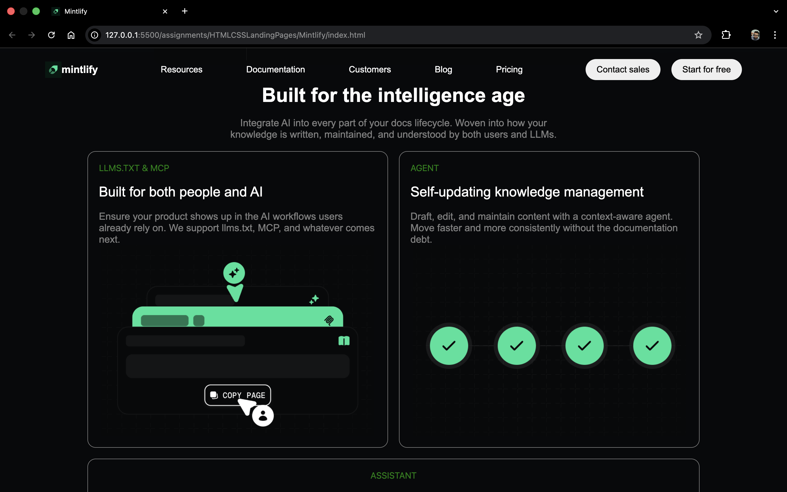
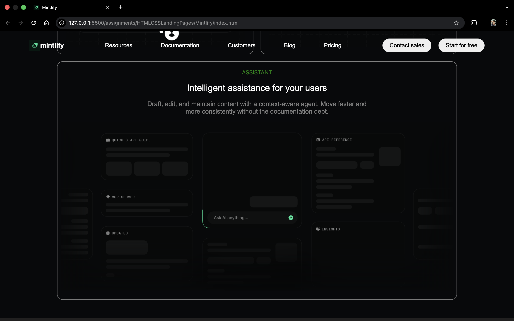
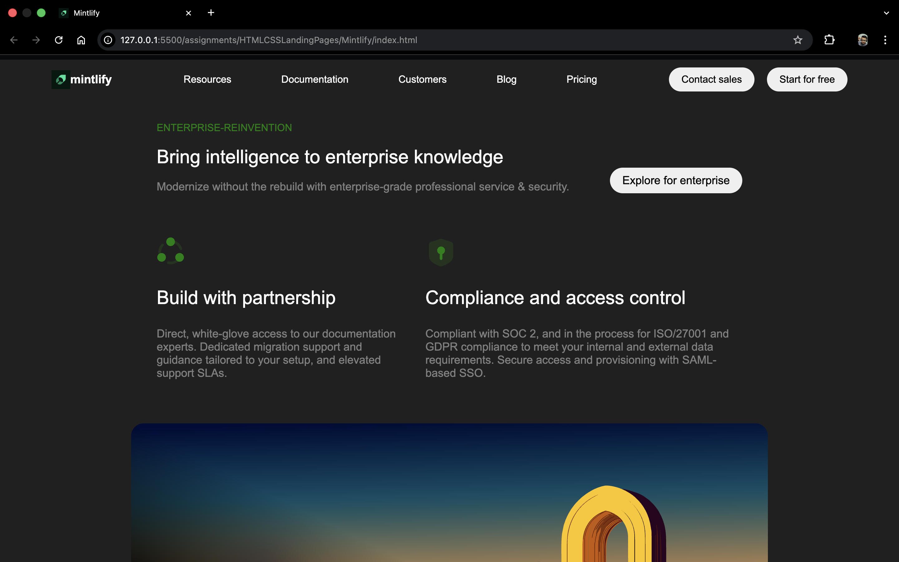
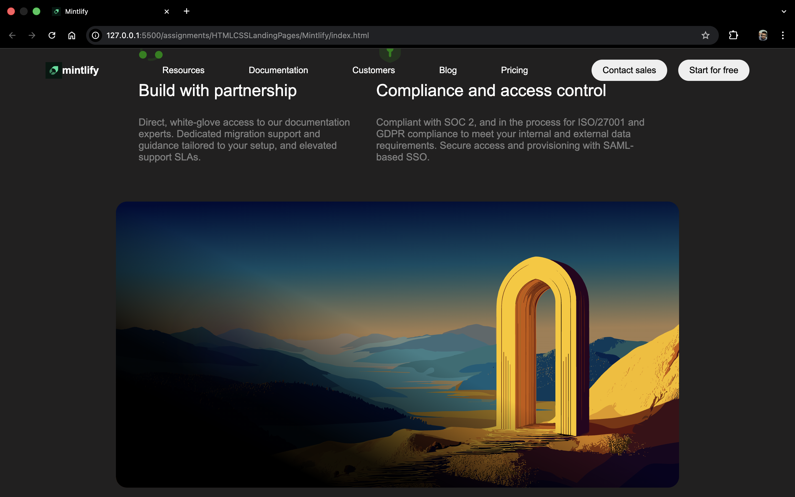
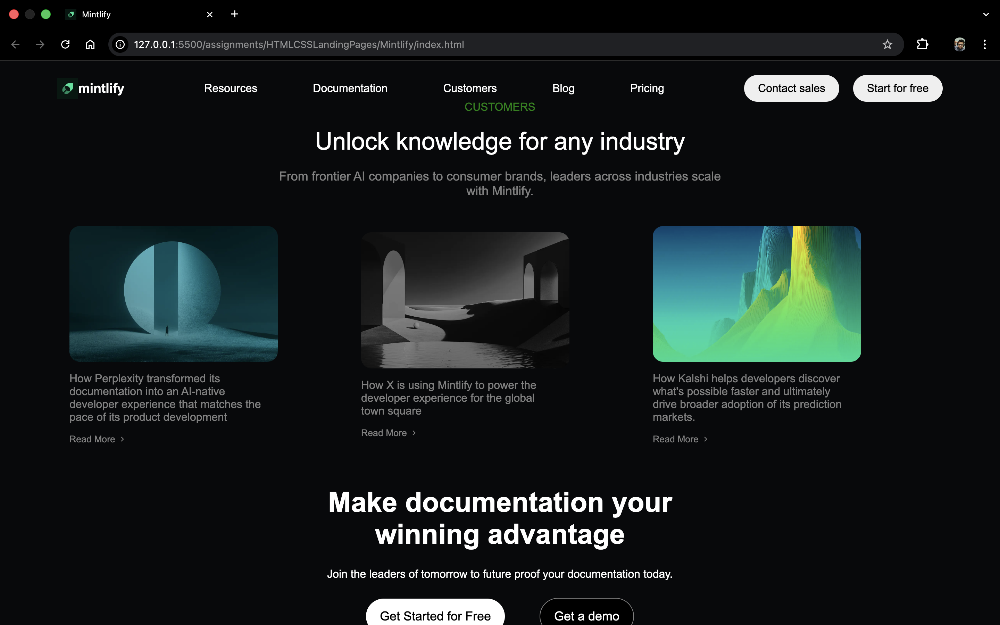

# Desktop-First documentation-style website - Mintlify

## Description

This assignment focuses on content structure, readability and layout accuracy. Created a desktop-first documentation-style website inspired by the Mintlify website.

## Sections Created

1. Top Navigation Bar

Logo, nav links, primary CTA 2. Hero Section

Main headline

Short description

Email input + CTA button

Large background illustration

3. Documentation Preview Section

Sidebar-style navigation (static)

Main content cards

4. Trusted By / Logos

Row of company logos 5. Feature Highlights

Two-column sections (text + visual) 6. Intelligent Assistant / UI Preview

Large UI mockup with description 7. Enterprise Features Section

Title + short intro

Feature blocks (security, compliance, etc.)

8. Case Studies / Customer Stories

Card-based layout with images 9. Final Call-To-Action

Strong heading

CTA buttons

10. Footer

Multi-column links

Company and legal info

## Screenshots

